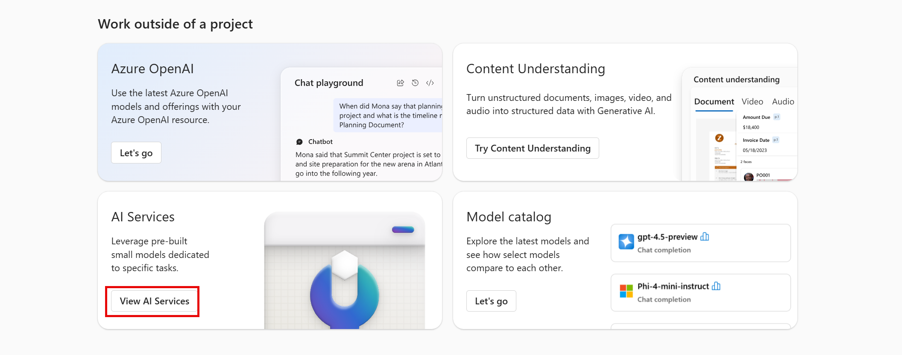

---
lab:
  title: Изучение служб ИИ Azure
---

# Изучение служб ИИ Azure

Службы ИИ Azure помогают пользователям создавать приложения ИИ с помощью готовых, предварительно созданных и настраиваемых API и моделей. В этом упражнении вы создадите ресурс в портал Azure и попробуйте использовать службы ИИ Azure. Цель этого упражнения — получить общее представление о том, как службы ИИ Azure подготавливаются и используются.

## *Создание ресурса служб* ИИ Azure в портал Azure

1. На вкладке браузера откройте портал Azure [https://portal.azure.com](https://portal.azure.com?azure-portal=true)при входе с учетной записью Майкрософт, связанной с вашей подпиской Azure.

1. Щелкните кнопку **＋Создать ресурс** и найдите *Службы ИИ Azure*. Выберите **создать** план**Службы ИИ Azure**. Вы перейдете на страницу, чтобы создать ресурс служб ИИ Azure. Настройте, используя следующие параметры:
    - **Подписка**: *ваша подписка Azure*.
    - **Группа ресурсов**: *выберите существующую или создайте новую группу ресурсов с уникальным именем*.
    - **Регион**: *выберите ближайший географический регион. Если в восточной части США, используйте "Восточная часть США 2".*
    - **Имя**: *укажите уникальное имя*.
    - **Ценовая категория**: *Standard S0.*
    - **Установив этот флажок, я признаю, что я прочитал и понял все приведенные ниже** термины: *Выбрано*.

1. Нажмите кнопку **"Рецензирование" и "****Создать**" и дождитесь завершения развертывания.

    *Поздравляю! Вы только что создали или подготовили ресурс служб искусственного интеллекта Azure. Тот, который вы подготовили, в частности, является ресурсом с несколькими службами.*

1. По завершении развертывания выберите элемент *Перейти к ресурсу*. 

## Ознакомьтесь с ключами и конечной точкой

Чтобы включить службы ИИ Azure в приложения, разработчикам требуется ключ службы и конечная точка. Ключи и конечная точка, используемые для разработки приложений, можно найти на портале Azure. 

1. На портале Azure выберите ресурс. В меню слева найдите в разделе *Управление ресурсами* пункт *Ключи и конечные точки*. Выберите **Ключи и конечные точки**, чтобы просмотреть конечную точку и ключи для вашего ресурса. 

## Просмотр служб ИИ Azure в действии

1. На вкладке браузера перейдите к [Azure AI Foundry](https://ai.azure.com?azure-portal=true).

1. Войдите со своей учетной записью. 

1. В разделе *"Работа за пределами проекта*" выберите плитку **View AI Services** .
 
      

1. *На странице "Службы* искусственного интеллекта" выберите плитку *"Визуальное распознавание и документ*", чтобы попробовать возможности Azure AI Vision и Document.

    

1. В разделе *"Просмотр всех возможностей* зрения" выберите вкладку **"Лицо** ". 

1. Выберите элемент *"Обнаружение лиц" на демонстрационной плитке изображения* . 

1. Попробуйте использовать службу распознавания лиц, которая является одной из многих служб ИИ Azure. Щелкните изображение и проверьте обнаруженные атрибуты. 

    

1. Прокрутите вниз до **раздела "Запуск кода** ". Выберите **"Просмотреть код**". Sroll вниз до раздела, который начинается с *импорта ос*. В приведенном примере кода вы увидите заполнители, где можно поместить ключ и конечную точку.

     

1. Если вы хотите создать приложение, использующее службы ИИ Azure, можно начать с предоставленного кода. Заменив заполнители ключом и конечной точкой собственной службы, приложение сможет отправлять запросы и получать ответы, использующие службы ИИ Azure. В случае службы распознавания лиц запрос* предназначен для службы *распознавания лиц для анализа изображения. Ответ ** — это обнаруженные атрибуты. 

    >**Обратите внимание** , что вам не нужно знать программирование для выполнения каких-либо упражнений в этом курсе. Мы по-прежнему рассмотрим службы ИИ Azure в действии с помощью портала Azure AI Foundry.  
 
## Очистка 

Завершив работу, вы можете удалить ресурс служб искусственного интеллекта Azure на портале Azure. Удаление ресурса — это способ снижения затрат, которые начисляются при наличии ресурса в подписке. Для этого перейдите на **страницу обзора** ресурса служб искусственного интеллекта Azure. Выберите **Удалить** в верхней части экрана.

