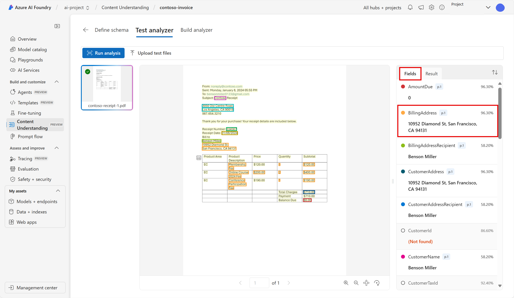

---
lab:
  title: Извлечение данных с помощью службы "Основные сведения о содержимом" на портале Azure AI Foundry
---

# Извлечение данных с помощью службы "Основные сведения о содержимом" на портале Azure AI Foundry

**Azure AI Content Understanding (предварительная версия)** использует генерированный ИИ для обработки содержимого многих типов (документов, изображений, видео и аудио) в определяемый пользователем формат выходных данных.

В этом упражнении вы будете использовать Azure AI Content Understanding на портале Azure AI Foundry, платформе Майкрософт для создания интеллектуальных приложений, чтобы распознать данные из счетов. 

Это упражнение занимает около **25** минут.

## Создание проекта Azure AI Foundry

Начнем с создания проекта Azure AI Foundry.

1. В веб-браузере откройте [портал](https://ai.azure.com) `https://ai.azure.com` Azure AI Foundry и войдите с помощью учетных данных Azure. Закройте все советы или панели быстрого запуска, открываемые при первом входе, и при необходимости используйте **логотип Azure AI Foundry** в левом верхнем углу, чтобы перейти на домашнюю страницу, которая выглядит следующим образом (закройте **панель справки** , если она открыта):

    

1. На домашней странице нажмите кнопку **+Создать проект**.

1. В мастере **создания проекта** введите допустимое имя проекта, а если предлагается существующий концентратор, выберите параметр для создания нового. Затем просмотрите ресурсы Azure, которые будут автоматически созданы для поддержки центра и проекта.

1. Выберите **"Настроить** " и укажите следующие параметры для центра:
    - **Имя концентратора: *допустимое имя** концентратора*
    - **Подписка**: *ваша подписка Azure*
    - **Группа** ресурсов. *Создание или выбор группы ресурсов*
    - **Расположение:** западная часть США. 
    - **Подключение служб ИИ Azure или Azure OpenAI**. *Создание нового ресурса служб ИИ*
    - **Подключение поиска** ИИ Azure: пропуск подключения

1. Нажмите кнопку **"Далее** " и просмотрите конфигурацию. Затем нажмите кнопку **"Создать** " и дождитесь завершения процесса.

1. При создании проекта закройте все отображаемые советы и просмотрите страницу проекта на портале Azure AI Foundry, которая должна выглядеть следующим образом:

    
 
1. Перейдите в меню слева на экране. Затем выберите **службы** ИИ.

1. *На странице "Службы* искусственного интеллекта" выберите плитку *"Основные сведения о содержимом", чтобы попробовать возможности Azure AI Content Understanding*.

## Анализ счета с помощью Azure AI Content Understanding в Azure AI Foundry 

Предположим, вы хотите извлечь данные из многих счетов и поместить их в базу данных. Вы можете использовать Azure AI Content Understanding для анализа одного счета и создания собственного анализатора, который может анализировать другие аналогичные счета. Начнем с создания задачи по пониманию содержимого.

1. Выберите **Пользовательский анализатор**. 

1. Нажмите кнопку **+Создать** и используйте следующие параметры для создания задачи распознавания содержимого:
    - **Имя** задачи: contoso-счет
    - **Описание**: задача анализа счетов
    - **Подключение** к службам искусственного интеллекта Azure: *используйте значение по умолчанию*
    - **учетная запись Хранилище BLOB-объектов Azure: *используйте учетную запись** по умолчанию*

1. Нажмите кнопку **"Создать**", а затем дождитесь создания задачи. 
1. **Выберите задачу contoso-invoice**. 

#### Определение схемы 

1. *На странице "Определение схемы*" можно добавить тестовые файлы. Скачайте [contoso-invoice-1.pdf](https://raw.githubusercontent.com/MicrosoftLearning/mslearn-ai-fundamentals/refs/heads/main/contoso-invoice-1.pdf) из `https://raw.githubusercontent.com/MicrosoftLearning/mslearn-ai-fundamentals/refs/heads/main/data/contoso-invoice-1.pdf`. 

1. Отправьте файл на страницу *определения схемы* . *Выберите шаблон анализа* счетов. Шаблон счета содержит предварительно выбранные поля данных, которые анализатор попытается обнаружить. 

    

1. Нажмите кнопку **создания**. Теперь у вас есть возможность изменять схему, добавляя или удаляя поля. Когда вы закончите просмотр полей, нажмите кнопку **"Сохранить**".

    

1. Дождитесь выполнения анализа. Это может занять какое-то время.

#### Тестирование анализатора 

1. После завершения анализа вы увидите, как анализатор выполнен на *странице анализатора* тестирования. Просмотрите вкладку *"Поля* ". Соответствуют ли эти данные тому, что вы видите в счете? 
    

1. Обратите внимание на оценку* достоверности рядом *с каждым полем. Оценка достоверности представляет, насколько уверена модель в том, что его результат является точным. Результаты с оценкой достоверности ближе к 100% указывают на большую уверенность в прогнозе.
1. Просмотрите вкладку *"Результаты* ". Те же сведения, которые отображаются на вкладке полей, отображаются на вкладке результатов в ФОРМАТЕ JSON. В формате JSON показано, как данные выглядят при отправке и из клиентского приложения. 

    

1. Служба "Распознавание содержимого" должна правильно определить текст, соответствующий полям в схеме. Если это не сделано, можно использовать *страницу данных* Метки для отправки еще одной образца формы и явно определить правильный текст для каждого поля. Если вы удовлетворены тем, насколько хорошо анализатор может обнаруживать данные в счете, перейдите на вкладку **"Анализатор** сборки". 

#### Создание анализатора 

Теперь, когда вы обучили модель для извлечения полей из примера счета, можно создать анализатор для использования с аналогичными формами. Создав анализатор, вы можете развернуть модель и использовать ее для автоматизации других задач счета.

1. На вкладке *"Анализатор сборки" выберите **+Build Analyzer***. Введите следующее: 
    - **Имя**: счет-анализатор
    - **Описание**: анализатор счетов

    

1. Выберите **Build** (Сборка). Дождитесь готовности нового анализатора (используйте кнопку "Обновить", чтобы проверить). Анализатор использует прогнозную модель, основанную на схеме, которую вы определили и проверили на предыдущих шагах. 
1. Теперь давайте попробуем протестировать созданный анализатор. Скачайте другой счет от Contoso [contoso-invoice-2.pdf](https://raw.githubusercontent.com/MicrosoftLearning/mslearn-ai-fundamentals/refs/heads/main/data/contoso-invoice-2.pdf)`https://raw.githubusercontent.com/MicrosoftLearning/mslearn-ai-fundamentals/refs/heads/main/data/contoso-invoice-2.pdf`.
1. Вернитесь на *страницу анализатора сборки и выберите ссылку для анализатора* счетов. Будут отображаться поля, определенные в схеме анализатора.
1. На странице "Анализатор счетов" выберите *"Тест*".
1. Нажмите кнопку **+Отправить тестовые файлы** для отправки *contoso-receipt-2.pdf*. Выберите **"Выполнить анализ** ", чтобы извлечь данные поля из тестовой формы. Просмотрите результаты теста.

    

1. Выберите вкладку *"Пример* кода". Найдите конечную точку ** в коде. *На этапе анализа* сборки процесса вы развернули модель понимания содержимого в конечной точке. Конечная точка может использоваться в коде, аналогично тому, что вы видите в примере, чтобы включить модель в повторяемый процесс в приложении.  

    

## Очистка

Если вы завершили работу со службой "Распознавание содержимого", удалите ресурсы, созданные в этом упражнении, чтобы избежать ненужных затрат Azure.

- На портале Azure AI Foundry перейдите к проекту с уведомлением contoso и удалите его.
- В портал Azure удалите группу ресурсов, созданную в этом упражнении.