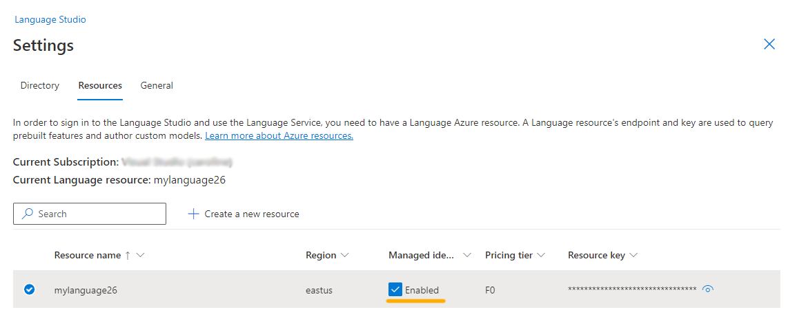

---
lab:
  title: Анализ текста с помощью Language Studio
---

# Анализ текста с помощью Language Studio

В этом упражнении вы изучите возможности языка искусственного интеллекта Azure, проанализировав некоторые примеры отзывов о отелях. Вы будете использовать Language Studio, чтобы понять, являются ли отзывы в основном положительными или отрицательными.

Обработка естественного языка (NLP) — это ветвь ИИ, которая занимается письменным и речным языком. Вы можете использовать NLP для создания решений, которые извлекают семантические значения из текста или речи или формулируют значимые ответы на естественном языке.

Например, предположим, что вымышленный агент по путешествиям Марги призывает клиентов отправлять отзывы о пребывании в отеле. Вы можете использовать службу языка для выявления ключевых фраз, определения положительных и отрицательных отзывов или анализа текста проверки для упоминание известных сущностей, таких как расположения или люди.

Служба языка искусственного интеллекта Azure включает анализ текста и возможности NLP. К ним относятся идентификация ключевых фраз в тексте и классификация текста на основе тональности.

## Создание ресурса *Языковой службы*

Вы можете использовать множество функций языка ИИ Azure с ресурсом служб искусственного интеллекта Azure или **языком****.** Существуют некоторые экземпляры, в которых можно использовать только ресурс языка. В приведенном ниже упражнении мы будем использовать **ресурс языка** . Если вы еще этого не сделали, создайте ресурс **Языковой службы** в своей подписке Azure.

1. На другой вкладке браузера откройте портал Azure, [https://portal.azure.com](https://portal.azure.com?azure-portal=true)выполнив вход с учетной записью Майкрософт, связанной с вашей подпиской Azure.

1. **Щелкните &65291; Создайте кнопку ресурса** и найдите *языковую службу*. Выберите **Создать** план службы** языка<a1/a0**>. Вы перейдете на страницу, чтобы **выбрать дополнительные функции**. Сохраните выбор по умолчанию и нажмите кнопку **"Продолжить", чтобы создать ресурс**. 

1. На странице **создания языка** настройте его с помощью следующих параметров:
    - **Подписка**: *ваша подписка Azure*.
    - **Группа ресурсов**: *выберите существующую или создайте новую группу ресурсов с уникальным именем*.
    - **Регион**: Восточная часть США.
    - **Имя**: *укажите уникальное имя*.
    - **Ценовая категория**: *бесплатный F0 или S, если бесплатная F0 недоступна*
    - **В проверка этом поле я признаю, что я прочитал и понял все термины ниже**: *Выбрано*.

1. Нажмите кнопку **"Рецензирование" и "****Создать**" и дождитесь завершения развертывания.

## Настройка ресурса в Azure AI Language Studio

1. На другой вкладке браузера откройте **Language Studio** [https://language.cognitive.azure.com](https://language.cognitive.azure.com?azure-portal=true) и войдите в систему.

1. При появлении запроса на **выбор ресурса** Azure сделайте следующее:
    - **Каталог Azure: *каталог** по умолчанию, используемый вами каталог*
    - **Подписка** Azure. *Выберите используемую подписку*
    - **Тип** ресурса: Язык
    - **Имя** ресурса: выберите только что созданный ресурс языковой службы. **

Затем выберите **Готово**.

> **Важно.** По состоянию на июль 2023 года службы искусственного интеллекта Azure охватывают все ранее известные как Cognitive Services и приложение Azure лиированные службы ИИ. Некоторые пользовательские интерфейсы по-прежнему обновляют свою ссылку на `Cognitive Services` `Azure AI services`. Два имени относятся к одному и тому же типу ресурса.

> **Примечание.** Если вам ***не*** предлагается выбрать языковой ресурс, возможно, у вас есть несколько языковых ресурсов в подписке. В этом случае:
> 1. На панели в верхней части страницы выберите **Параметры (&9881;)**. 
> 1. На странице **Параметры** перейдите на вкладку **Ресурсы**.
> 1. Выберите только что созданный ресурс и выберите **ресурс** Switch. Убедитесь, что управляемое удостоверение включено****.
> 
> 1. В верхней части страницы выберите **Language Studio** , чтобы вернуться на домашнюю страницу Language Studio.

## Анализ отзывов в Language Studio

1. В веб-браузере перейдите в Language Studio по адресу[https://language.cognitive.azure.com](https://language.cognitive.azure.com?azure-portal=true).** **

1. На целевой **странице "Добро пожаловать в Language Studio** " выберите **вкладку "Классифицировать текст** ", а затем выберите плитку **"Анализ тональности" и "Мои мнения** ".

1. В разделе *"Выбор текста"* выберите **английский** язык.

1. В разделе *"Выбор ресурса* Azure" выберите ресурс.

1. В разделе *Ввод собственного текста отправьте файл или используйте один из примеров текста*, скопируйте и вставьте следующую проверку:

    ```
    Tired hotel with poor service
    The Royal Hotel, London, United Kingdom
    5/6/2018
    This is an old hotel (has been around since 1950's) and the room furnishings are average - becoming a bit old now and require changing. The internet didn't work and had to come to one of their office rooms to check in for my flight home. The website says it's close to the British Museum, but it's too far to walk.
    ```

1. Установите флажок, чтобы подтвердить, что демонстрация будет нести расходы и может нести расходы, а затем нажмите кнопку **"Выполнить**".

1. Просмотрите выходные данные. Обратите внимание, что *документ* анализируется для тональности, а также каждого *предложения*. Выберите **предложение 1** , чтобы отобразить анализ тональности для этого предложения. 

Обратите внимание, что за общими настроениями следует оценки рядом с тремя категориями, положительным показателем, *нейтральным показателем**, **отрицательным показателем*. В каждой из категорий предоставляется оценка от 0 до 1. Эти оценки достоверности указывают, насколько вероятно предоставленный текст является определенным тональностью. 

Чтобы закрыть предложение 1, выберите **предложение 1** .

1. Прокрутите страницу до выбора **поля "Очистить текст**" и скопируйте и вставьте следующую проверку:

    ```
    Good Hotel and staff
    The Royal Hotel, London, UK
    3/2/2018
    Clean rooms, good service, great location near Buckingham Palace and Westminster Abbey, and so on. We thoroughly enjoyed our stay. The courtyard is very peaceful and we went to a restaurant which is part of the same group and is Indian ( West coast so plenty of fish) with a Michelin Star. We had the taster menu which was fabulous. The rooms were very well appointed with a kitchen, lounge, bedroom and enormous bathroom. Thoroughly recommended.
    ```
    
    
1. Выберите **Выполнить**. Просмотрите выходные данные и просмотрите уровень тональности и достоверности.

1. Снова нажмите кнопку **"Очистить текстовое** поле", а затем скопируйте и вставьте следующую проверку:

    >Очень шумно, очень маленькие номера Lombard Hotel, Сан-Франциско, США 5 сентября 2018 г. Отель находится на Ломбард-стрит, очень оживленном ШЕСТИПОЛОСНОМ шоссе, которое ведет прямо с моста "Золотые ворота". Много машин с раннего утра до поздней ночи, особенно на выходных. Шум бы не так мешал, если бы комнаты были лучше изолированы, но шумоизоляции там нет Чтобы заснуть, пришлось использовать затычки для ушей, а на следующий день не хватило сил насладиться городом. Комнаты очень маленькие. Я выбрал номер с двумя двуместными кроватями, но в нем едва хватило для них места. Семье из четырех было очень тесно. При этом номера чистые и недавно обновлены. Гостиница находится в приморском районе, где много заведений общественного питания, а в шаговой доступности — форт. Возможно, отель неплох для молодых людей, которые поздно ложатся спать и стеснены в средствах

1. Выберите **"Запустить** " и просмотрите тональность вместе с уровнем достоверности. Просмотрите текст и сравните текст с анализом тональности, возвращенным службой.

В этом упражнении вы использовали Language Studio для создания нового ресурса языка или использования существующего ресурса языка. Вы включили ресурс в Параметры, прежде чем попробовать службу интеллектуального анализа мнений и мнений. Затем вы проверили службу с тремя частями текста.

## Очистка

Если вы не собираетесь выполнять больше упражнений, удалите все ресурсы, которые больше не нужны. Это позволяет избежать каких-либо ненужных затрат.

1. **Откройте портал Azurehttps://portal.azure.com** [](https://portal.azure.com) и выберите группу ресурсов, содержащую созданный ресурс.
1. Выберите ресурс и нажмите кнопку **"Удалить** ", а затем **"Да** ", чтобы подтвердить. Затем ресурс удаляется.

## Подробнее

Дополнительные сведения о том, что можно сделать с помощью этой службы, см. на [странице языковой службы](https://learn.microsoft.com/azure/ai-services/language-service/overview).
