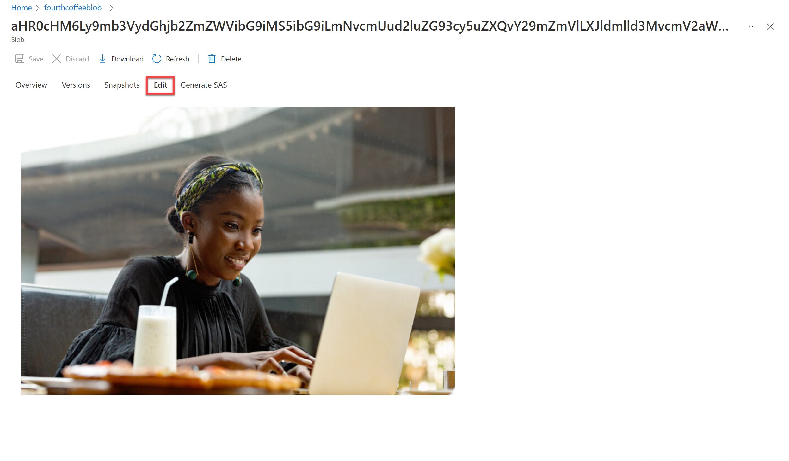

---
lab:
  title: Изучение индекса поиска ИИ Azure (пользовательский интерфейс)
---

# Изучение индекса поиска ИИ Azure (пользовательский интерфейс)

Представьте, что вы работаете в компании Fourth Coffee, владеющей сетью кофеен по всему миру. Вас попросили помочь создать решение для интеллектуального анализа знаний, которое упрощает поиск информации об обслуживании клиентов. Вы решили создать индекс поиска ИИ Azure с помощью данных, извлеченных из отзывов клиентов.  

В этом задании вы выполните указанные ниже задачи.

- Создание ресурсов Azure
- Извлечение данных из источника данных
- Обогащение данных с помощью навыков ИИ
- Использование индексатора Azure на портале Azure
- Выполнение запросов к поисковому индексу.
- Результаты проверки, сохраненные в хранилище знаний

## Необходимые ресурсы Azure

Решение, которое вы создадите для компании Fourth Coffee, должно иметь следующие ресурсы в вашей подписке Azure.

- **Ресурс поиска** ИИ Azure, который будет управлять индексированием и запросами.
- Ресурс **Службы АИ Azure**, который предоставляет службы ИИ для навыков, которые ваше решение для поиска может использовать для обогащения данных в источнике с помощью формируемой ИИ аналитики.

    > **Обратите внимание, что** ресурсы службы ИИ Azure должны находиться в одном расположении.

- **Учетная запись хранения** с контейнерами BLOB-объектов для хранения необработанных документов и других коллекций таблиц, объектов или файлов.

### *Создание ресурса поиска* ИИ Azure

1. Войдите на [портал Azure](https://portal.azure.com/learn.docs.microsoft.com?azure-portal=true).

1. **Нажмите кнопку "+ Создать ресурс**", найдите *поиск azure AI* и создайте **ресурс поиска** ИИ Azure со следующими параметрами:

    - **Подписка**: *ваша подписка Azure*.
    - **Группа ресурсов**: *выберите существующую или создайте новую группу ресурсов с уникальным именем*.
    - **Имя службы**: *уникальное имя*.
    - **Расположение**: *выберите любой доступный регион*.
    - **Ценовая категория**: Базовый

1. Выберите **Проверка и создание** и после получения уведомления **Проверка пройдена** щелкните **Создать**.

1. После завершения развертывания выберите **Перейти к ресурсу**. На странице обзора поиска ИИ Azure можно добавлять индексы, импортировать данные и создавать индексы поиска.

### Создание ресурса Служб ИИ Azure

Вам потребуется подготовить **ресурс служб** искусственного интеллекта Azure, который находится в том же расположении, что и ресурс поиска ИИ Azure. Решение для поиска будет использовать этот ресурс для обогащения данных в хранилище с помощью генерируемой ИИ аналитики.

1. Вернитесь на домашнюю страницу портала Azure. Щелкните кнопку **＋Создать ресурс** и найдите *Службы ИИ Azure*. Выберите **создать** план**Службы ИИ Azure**. Вы перейдете на страницу, чтобы создать ресурс служб ИИ Azure. Настройте, используя следующие параметры:
    - **Подписка**: *ваша подписка Azure*.
    - **Группа** ресурсов: *та же группа ресурсов, что и ресурс* поиска ИИ Azure.
    - **Регион**: *то же расположение, что и ресурс* поиска ИИ Azure.
    - **Имя**: *уникальное имя*.
    - **Ценовая категория**: Стандартный S0.
    - **By checking this box I acknowledge that I have read and understood all the terms below** (Устанавливая этот флажок, я подтверждаю, что я прочел(-ла) и понимаю все приведенные ниже условия): флажок установлен

1. Выберите **Review + create** (Просмотреть и создать). Увидев ответ **Проверка пройдена**, выберите **Создать**.

1. Дождитесь завершения развертывания и просмотрите сведения о развертывании.

### Создание учетной записи хранилища

1. Вернитесь на домашнюю страницу портала Azure и нажмите кнопку **+ Создать ресурс**.

1. Найдите *учетную запись хранения*, а затем создайте ресурс **Учетная запись хранения**, задав такие параметры:
    - **Подписка**: *ваша подписка Azure*.
    - **Группа** ресурсов: *та же группа ресурсов, что и ресурсы* службы поиска ИИ Azure и Azure.
    - **Имя учетной записи хранения**: *уникальное имя*.
    - **Расположение**: *выберите любое доступное расположение*.
    - **Производительность**: Стандарт
    - **Избыточность**: выберите локально избыточное хранилище (LRS)

1. Нажмите **Проверить**, а затем — **Создать**. Дождитесь завершения развертывания, а затем перейдите к развернутому ресурсу.

1. В созданной учетной записи хранения Azure в области меню слева выберите **Конфигурация** (в разделе **Настройки**).
1. Измените параметр *Разрешить анонимный доступ к BLOB-объектам* на **Включен**, а затем нажмите **Сохранить**.

## Отправка документов в хранилище Azure

1. На левой панели меню выберите **Контейнеры**.

    

1. Выберите **+ Container** (+ Контейнер). В правой части появится панель.

1. Введите параметры ниже и нажмите **Создать**.
    - **Имя**: coffee-reviews  
    - **Общедоступный уровень доступа**: Контейнер (анонимный доступ на чтение к контейнерам и большим двоичным объектам)
    - **Дополнительно**: *без изменений*.

1. На новой вкладке браузера скачайте [архивированные отзывы](https://aka.ms/mslearn-coffee-reviews) `https://aka.ms/mslearn-coffee-reviews`о кофе и извлеките файлы в папку *отзывов* .

1. На портале Azure выберите контейнер *coffee-reviews*. На странице контейнера нажмите кнопку **Отправить**.

    

1. В области **Отправка BLOB-объекта** **Выберите файл**.

1. В окне Explorer выберите **все** файлы в папке *reviews*, щелкните **Открыть**, а затем — **Передать**.

    

1. Когда передача завершится, панель **Передать BLOB-объект** можно закрыть. Теперь ваши документы находятся в контейнере хранилища *coffee-reviews*.

## Индексация документов

После получения документов в хранилище можно использовать поиск ИИ Azure для извлечения аналитических сведений из документов. Портал Azure предоставляет *мастер импорта данных*. С помощью этого мастера вы сможете автоматически создавать индексы и индексаторы для поддерживаемых источников данных. Вы будете использовать мастер для создания индекса и импорта документов поиска из хранилища в индекс поиска ИИ Azure.

1. В портал Azure перейдите к ресурсу службы поиска ИИ Azure. На странице **Обзор** щелкните **Импорт данных**.

    

1. На странице **Подключиться к данным** в списке **Источник данных** выберите **Хранилище BLOB-объектов Azure**. Укажите следующие значения для хранилища данных:
    - **Источник данны**: Хранилище BLOB-объектов Azure.
    - **Имя источника данных**: coffee-customer-data.
    - **Извлекаемые данные**: содержимое и метаданные.
    - **Режим анализа**: значение по умолчанию.
    - **Строка подключения**: *щелкните **Выбрать существующее подключение**. Выберите учетную запись хранения и контейнер **coffee-reviews**, а затем щелкните **Выбрать**.
    - **Проверка подлинности управляемого удостоверения**: нет.
    - **Имя контейнера**: *этот параметр заполняется автоматически после выбора существующего подключения*.
    - **Папка BLOB-объектов**: *оставьте это поле пустым*.
    - **Описание**: отзывы о магазинах Fourth Coffee.

1. Выберите **Далее: Добавить когнитивные навыки (необязательно)**.

1. В разделе **Подключение Cognitive Services** выберите ресурс служб ИИ Azure.  

1. В разделе **Добавление обогащений** задайте следующие параметры:
    - Измените значение поля **Имя набора навыков** на **coffee-skillset**.
    - Выберите поле **Включить распознавание текста и объединить весь текст в поле merged_content**.
        > **Примечание** Установка флажка **Включить распознавание текста** позволяет увидеть все параметры обогащенного поля.
    - Убедитесь, что для параметра **Поле источника данных** задано значение **merged_content**.
    - Измените значение параметра **Степень детализации обогащения** на **Страницы (5000 фрагментов символов)**.
    - Не выбирайте параметр *Enable incremental enrichment* (Включить добавочное обогащение).
    - Выберите следующие обогащенные поля:

        | Когнитивный навык | Параметр | Имя поля |
        | --------------- | ---------- | ---------- |
        | Извлечение названий расположений | | locations |
        | Извлечение ключевых фраз | | keyphrases |
        | Определение тональности | | sentiment |
        | Создание тегов по изображениям | | imageTags |
        | Создание подписей по изображениям | | imageCaption |

1. В разделе **Сохранение обогащений в хранилище знаний** установите такие флажки:
    - Проекции изображений
    - Документы
    - Страницы
    - Ключевые фразы
    - Сущности
    - Сведения об изображении
    - Ссылки на изображения

    > **Примечание** Появится предупреждение с запросом на **строку подключения к учетной записи хранения**.
    >
    > 
    >
    > 1. Выберите **Выбрать существующее подключение**. Выберите учетную запись хранения, созданную ранее.
    > 1. Нажмите **+ Контейнер**, чтобы создать новый контейнер с именем **knowledge-store** и уровнем конфиденциальности **Частный**, а затем нажмите **Создать**.
    > 1. Выберите контейнер **knowledge-store** и нажмите кнопку **Выбрать** в нижней части экрана.

1. Выберите **Проекции BLOB-объектов Azure: Документ**. Появится параметр *Имя контейнера* с автоматически подставленным значением *knowledge-store*. Не изменяйте имя контейнера.

1. Нажмите кнопку **Далее: настройка целевого индекса**. Измените значение параметра **Имя индекса** на **coffee-index**.

1. Убедитесь, что для параметра **Ключ** задано значение **metadata_storage_path**. Не задавайте значение для параметра **Имя средства подбора**, а для параметра **Режим поиска** оставьте автоматически заданное значение.

1. Проверьте параметры полей индекса по умолчанию. Выберите параметр **фильтруемое** для всех полей, уже выбранных по умолчанию.

    

1. Выберите **Далее: Создание индексатора**.

1. Измените значение параметра **Имя индексатора** на **coffee-indexer**.

1. Оставьте для параметра **Расписание** значение **Однократно**.

1. Разверните раздел **Дополнительные параметры**. Убедитесь, что вы выбрали вариант **Ключи шифрования Base-64**, поскольку ключи шифрования могут увеличить эффективность индексов.

1. Нажмите кнопку **Отправить**, чтобы создать источник данных, набор навыков, индекс и индексатор. Индексатор запускается автоматически и запускает конвейер индексации, который:
    - Извлекает из источника данных поля метаданных документа и содержимое.
    - Запускает набор когнитивных навыков для создания дополнительных обогащенных полей.
    - сопоставляет извлеченные поля с индексом.

1. Вернитесь на страницу ресурса поиска ИИ Azure. На левой панели в разделе **"Управление поиском**" выберите  **индексаторы**. Выберите только что созданный **индексатор** кофе. Немного подождите и нажимайте кнопку **&orarr;Обновить**, пока значение параметра **Состояние** не изменится на "Выполнено".

1. Выберите имя индексатора, чтобы просмотреть дополнительные сведения.

    

## Запрос индекса

Используйте проводник поиска для написания и тестирования запросов. Проводник поиска — это встроенное в портал Azure средство, позволяющее легко проверить качество индекса поиска. С помощью проводника поиска можно создавать запросы и просматривать результаты в формате JSON.

1. На странице *Обзор* службы поиска выберите **Проводник поиска** в верхней части экрана.

   

2. Обратите внимание, что выбран индекс *coffee-index*, который вы создали. Под выбранным индексом измените представление* на *** представление** JSON. 

    

В поле редактора **** запросов JSON скопируйте и вставьте: 
```json
{
    "search": "*",
    "count": true
}
```
3. Нажмите **Поиск**. Этот поисковой запрос возвращает все документы в индексе поиска, включая количество всех документов в поле **@odata.count**. Индекс поиска должен вернуть документ JSON, содержащий результаты поиска.

4. Теперь выполним фильтрацию по расположению. В поле редактора **** запросов JSON скопируйте и вставьте: 
```json
{
    "search": "locations:'Chicago'",
    "count": true
}
```
5. Нажмите **Поиск**. Запрос выполняет поиск по всем документам в индексе и отфильтровывает проверки с расположением в Чикаго. Вы должны увидеть `3` в `@odata.count` поле.

6. Теперь выполним фильтрацию по тональности. В поле редактора **** запросов JSON скопируйте и вставьте: 
```json
{
    "search": "sentiment:'negative'",
    "count": true
}
```
7. Нажмите **Поиск**. Запрос выполняет поиск по всем документам в индексе и отфильтровывает проверки с отрицательной тональностью. Вы должны увидеть `1` в `@odata.count` поле.

   > **Примечание** Просмотрите, как отсортированы результаты по `@search.score`. Это оценка, назначенная поисковой системой, которая указывает, насколько результаты соответствуют данному запросу.

8. Одна из проблем, которую мы, возможно, захотим решить, заключается в причинах, по которым клиенты оставляют определенные отзывы. Давайте взглянем на ключевые фразы, связанные с отрицательными отзывами. Как вы думаете, что может быть причиной такого отзыва?

## Изучение хранилища знаний

Давайте оценим мощь хранилища знаний в действии. При выполнении действий в *мастере импорта данных* вы также создали хранилище знаний. В хранилище знаний находятся обогащенные данные, извлеченные с помощью навыков ИИ и сохраненные в виде проекций и таблиц.

1. На портале Azure вернитесь к своей учетной записи хранения Azure.

2. На левой панели меню выберите **Контейнеры**. Выберите контейнер **knowledge-store**.

    

3. Выберите любой элемент, а затем щелкните файл **objectprojection.json**.

    

4. Нажмите кнопку **Изменить**, чтобы просмотреть JSON, созданный для одного из документов в хранилище данных Azure.

    

5. Щелкните путь навигации BLOB-объектов хранилища в верхней левой части экрана, чтобы вернуться к разделу *Контейнеры* учетной записи хранения.

    

6. Выберите *Контейнеры*, а затем экземпляр *coffee-skillset-image-projection*. Выберите любой элемент.

    

7. Выберите любой из *JPG-файлов*. Нажмите кнопку **Изменить**, чтобы просмотреть изображение, сохраненное из документа. Обратите внимание, что таким образом хранятся все изображения из документов.

    

8. Щелкните путь навигации BLOB-объектов хранилища в верхней левой части экрана, чтобы вернуться к разделу *Контейнеры* учетной записи хранения.

9. Выберите **Обозреватель хранилища** на панели слева, а затем — **Таблицы**. Для каждой сущности в индексе существует таблица. Выберите таблицу *coffeeSkillsetKeyPhrases*.

    Взгляните на ключевые фразы, которые хранилище знаний смогло извлечь из содержимого отзывов. Многие из полей являются ключами, поэтому можно связать таблицы как реляционную базу данных. А в последнем поле отображаются ключевые фразы, извлеченные набором навыков.

## Подробнее

Этот простой индекс поиска только некоторые возможности azure AI служба . Дополнительные сведения о том, что можно сделать с этой службой, см[. на странице](https://learn.microsoft.com/azure/search) azure AI служба .
