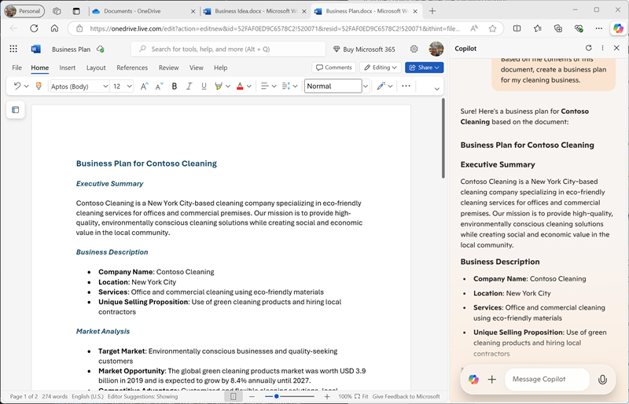

---
lab:
  title: Изучение Copilot в Microsoft Edge
---
# Изучение Microsoft Copilot в Microsoft Edge

В этом упражнении вы изучите некоторые способы, с помощью которых Microsoft Copilot может использовать генерированный ИИ, чтобы повысить эффективность при создании нового содержимого. В этом упражнении вы начнете с некоторых высокоуровневых заметок для бизнес-идеи и используйте Copilot в Microsoft Edge, чтобы помочь вам разработать бизнес-план и презентацию для потенциальных инвесторов.

Это упражнение должно занять около **40** минут.

> **Примечание.** В этом упражнении предполагается, что у вас есть [личная учетная запись Майкрософт (например, учетная запись](https://signup.live.com) outlook.com), с помощью которой вы вошли в [Microsoft Edge](https://www.microsoft.com/edge/download) на компьютере.

## Использование Copilot для изучения документа и исследования идеи

Чтобы начать изучение генерируемого искусственного интеллекта, давайте используем Microsoft Copilot в Edge для изучения существующего документа и извлечения некоторых аналитических сведений из него.

1. В Microsoft Edge перейдите к [OneDrive](https://onedrive.live.com) `https://onedrive.live.com` и войдите в систему с помощью личной учетной записи Майкрософт, закрывая все приветственные сообщения или предложения, отображаемые.
1. На другой вкладке браузера откройте документ [бизнес-Idea.docx](https://github.com/MicrosoftLearning/mslearn-ai-fundamentals/raw/main/data/generative-ai/Business%20Idea.docx) из `https://github.com/MicrosoftLearning/mslearn-ai-fundamentals/raw/main/data/generative-ai/Business%20Idea.docx`. Затем, когда документ откроется в Edge, выберите параметр **сохранить копию в OneDrive и сохранить документ в папке "Документы **" в **OneDrive**. Затем документ должен автоматически открыться в Microsoft Word online.

    > **Совет.** Если вы не видите возможность сохранить копию файла в OneDrive, скачайте его на локальный компьютер. Затем в OneDrive откройте **папку "Документы"** и нажмите **кнопку +Добавить новую** , чтобы отправить **файл бизнес-Idea.docx** с локального компьютера в OneDrive.

1. Просмотрите текст в **бизнесе Idea.docx**, описывающие некоторые идеи высокого уровня для очистки бизнеса в Нью-Йорке.
1. **Используйте значок Copilot на панели инструментов Edge, чтобы открыть панель Copilot**, как показано ниже:

    

1. В области Copilot прокрутите вниз, чтобы просмотреть все содержимое по мере необходимости, и убедитесь, что вкладка чата выбрана, и что **стиль беседы** задан **как More Balanced** , это обеспечит, чтобы Copilot ответил с балансом творчества и фактической точности.
1. В поле чата в нижней части панели Copilot введите следующую команду:

    ```
    What is this document about?
    ```

    При появлении запроса убедитесь, что вы хотите разрешить Copilot получить доступ к странице.

1. Просмотрите ответ от Copilot, который должен обобщать основные моменты в документе, как показано ниже:

    

    > **Примечание.** Конкретный ответ может отличаться.

1. Введите следующий запрос:

    ```
    How do I go about setting up a business in New York?
    ```

1. Просмотрите ответ, который должен содержать некоторые советы и ссылки на ресурс, чтобы помочь вам приступить к настройке бизнеса в Нью-йорке, и может включать некоторые предлагаемые дальнейшие запросы, чтобы получить дополнительные сведения.

    > **Важно:** ответ, созданный ИИ, основан на общедоступной информации в Интернете. Хотя это может быть полезно, чтобы помочь вам понять шаги, необходимые для настройки бизнеса, это не гарантирует 100 % точных и не заменяет необходимость профессиональных консультаций!

## Создание содержимого для бизнес-плана с помощью Copilot

Теперь, когда вы сделали некоторые первоначальные исследования, давайте поможем Вам разработать бизнес-план для вашей компании по очистке.

1. Если документ " **Бизнес-Idea.docx"** по-прежнему открыт в Microsoft Edge, в области Copilot введите следующий запрос:

    ```
    Suggest a name for my cleaning business
    ```

1. Просмотрите предложения и выберите имя для вашей компании по очистке (или продолжить поиск нужного имени).
1. Введите следующий запрос, заменив *Contoso Cleaning* на имя компании по своему усмотрению:

    ```
    Write a business plan for "Contoso Cleaning" based on the information in this document. Include an executive summary, market overview, and financial projections.
    ```

1. Просмотрите ответ и в выходных данных используйте **значок копирования** (&128461;), чтобы скопировать его в буфер обмена. Затем выделите весь текст в документе **бизнес-Ideas.docx** и вставьте скопированный текст в документ, чтобы заменить его. Наконец, обязать вставленный текст, заменив начальный текст в ответе (в котором Copilot признал инструкцию) заголовком для имени компании по очистке. В конечном итоге вам потребуется документ бизнес-плана, аналогичный следующему:

    

1. В области Copilot введите следующую строку:

    ```
    Create a corporate logo for the cleaning company. The logo should be round and include an iconic New York landmark.
    ```

1. Просмотрите ответ, который должен представлять четыре варианта логотипа, созданного Microsoft Designer.
1. Используйте дополнительные запросы, чтобы выполнить итерацию по дизайну (например, до тех пор, `Make it green and blue`пока у вас есть логотип, с которым вы довольны.
1. Щелкните правой кнопкой мыши нужный дизайн логотипа и скопируйте его в буфер обмена. Затем вставьте его в верхнюю часть документа бизнес-плана, как показано ниже:

    

1. Закройте вкладку Microsoft Word и вернитесь в папку **"Документы** " в OneDrive.

## Создание содержимого презентации с помощью Copilot

С помощью Copilot вы создали проект бизнес-плана для очистки бизнес-идеи. Теперь вам потребуется эффективная презентация, чтобы убедить инвестора предоставить вам финансирование для начала бизнеса.

1. В папке **"Документы"** в OneDrive добавьте новую **презентацию** PowerPoint.

    Если панель конструктора **** открывается автоматически, закройте ее.

1. На заголовке слайда презентации введите имя вашей компании по очистке в качестве заголовка и `Investor Opportunity` в качестве подзаголовок.
1. Добавьте новый слайд с помощью макета слайда **"Два содержимого** " (который включает заголовок и два заполнителя для содержимого).
1. Измените название `Benefits of Hiring a Commercial Cleaner`слайда на .
1. В области Copilot введите следующую строку:

    ```
    Write a summary of the benefits of using a corporate cleaning company for your business. The summary should consist of five short bullet points.
    ```

1. Скопируйте ответ Copilot на буфер обмена и вставьте его в заполнитель содержимого слева. Затем удалите первоначальное предложение с подтверждением запроса и переформатировать текст в заполнитель до тех пор, пока вы не будете удовлетворены.
1. В области Copilot введите следующую строку:

    ```
    Create a photorealistic image of a clean office.
    ```

1. Когда Copilot создал нужное изображение, скопируйте его в буфер обмена и вставьте его в заполнитель содержимого справа от слайда.

    **Если панель конструктора** открывается автоматически, выберите нужный макет слайда. Затем закройте область конструктора****.

1. Примените любое дополнительное переформатирование, которое вы считаете обязательным, пока не будете иметь слайд, который выглядит примерно так:

    

1. В строке заголовка PowerPoint выберите имя презентации по умолчанию (**Presentation**) и переименуйте его `Business Presentation.pptx`в .
1. Закройте вкладку PowerPoint и вернитесь в папку **"Документы** " в OneDrive.

## Создание сообщения электронной почты с помощью Copilot

Вы создали некоторые материалы, чтобы помочь вам приступить к работе. Теперь пришло время обратиться к инвестору, стремящегося к некоторому финансированию стартапов.

1. **Используйте средство** запуска приложений в левой части строки заголовка OneDrive, чтобы открыть **Outlook**.
1. Создайте сообщение электронной почты и введите **поле "To** " с собственным адресом электронной почты.
1. В области Copilot выберите вкладку **Compose** . Затем задайте следующие параметры для создания нового содержимого:
    - **Напишите:**`Request a meeting with an investment bank to discuss funding for a commercial cleaning business.`
    - **Тон**: Профессиональный
    - **Формат: электронная** почта
    - **Длина: средняя**
1. Выберите " **Создать черновик**" и просмотрите созданные выходные данные.
1. Используйте созданное содержимое для завершения электронной почты, как показано ниже:

    

    Вы можете отправить сообщение электронной почты себе, если вы хотите!

## Задача

Теперь вы узнали, как использовать Copilot для исследования идей и создания контента, почему бы не попробовать изучить дальше? Чтобы начать новый сеанс Copilot, на **вкладке "Чат** " выберите **значок "Создать раздел** " рядом с полем запроса, а затем попробуйте использовать Copilot для планирования мероприятия по повышению грамотности детей в локальной библиотеке. Некоторые действия, которые можно попробовать включить:

- Изучите некоторые советы по поощрению детей читать в раннем возрасте.
- Создайте флайер или плакат для события.
- Создайте электронное письмо для кампании, чтобы пригласить местных детских авторов прийти и поговорить на мероприятии.
- Создайте презентацию для запуска события.

Будьте так же изобретательны, как вам нравится, и изучите, как Copilot может помочь вам, найти информацию, создать и уточнить текст, создать изображения и ответить на вопросы.


## Заключение

В этом упражнении вы использовали Copilot в Microsoft Edge для поиска информации и создания содержимого. Надеюсь, вы узнали, как использовать генерированный ИИ в copilot может помочь с производительностью и творчеством.

Хотя бесплатные службы, используемые в этих упражнениях, несомненно, очень мощны, вы можете достичь еще больше с помощью таких служб, как [Copilot для Microsoft 365](https://www.microsoft.com/microsoft-365/enterprise/copilot-for-microsoft-365), в которых Microsoft Copilot интегрирован в приложения для повышения производительности Windows и Microsoft Office, обеспечивая высоко контекстную помощь с общими задачами. Microsoft 365 позволяет реализовать возможности генерирования искусственного интеллекта в бизнес-данные и процессы, интегрируясь в существующую ИТ-инфраструктуру, чтобы обеспечить управляемое, безопасное решение.