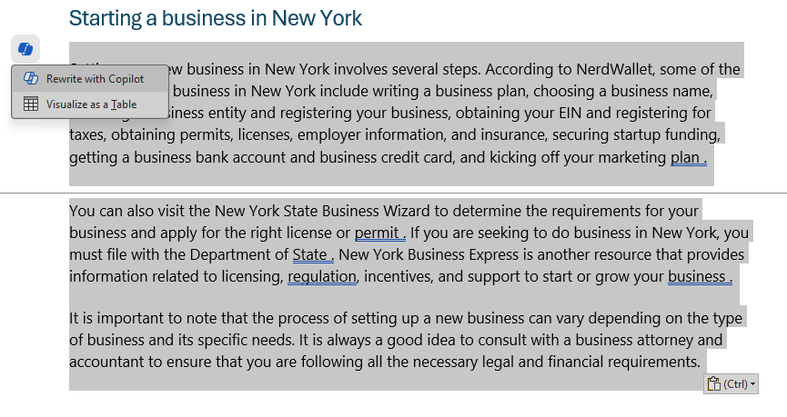

---
lab:
  title: Изучение Copilot для Microsoft 365
---
# Изучение Copilot для Microsoft 365

В этом упражнении вы изучите некоторые способы, с помощью которых Microsoft Copilot может использовать генерированный ИИ, чтобы повысить эффективность при создании нового содержимого. В этом упражнении вы начнете с некоторых высокоуровневых заметок для бизнес-идеи и используйте Copilot для Microsoft 365 в нескольких приложениях, таких как Word, PowerPoint и Excel, чтобы помочь вам разработать бизнес-план и презентацию для потенциальных инвесторов.

Это упражнение должно занять около **40** минут.

> **Примечание.** Для этого упражнения требуется **лицензия Copilot для Microsoft 365** из вашей организации.

## Использование Copilot для изучения документа и исследования идеи

Чтобы начать изучение генерируемого искусственного интеллекта, давайте используем Copilot для Word для изучения существующего документа и извлечения некоторых аналитических сведений из него.

1. В веб-браузере откройте документ [Бизнес Idea.docx](https://github.com/MicrosoftLearning/mslearn-ai-fundamentals/raw/main/data/generative-ai/Business%20Idea.docx) по адресу `https://github.com/MicrosoftLearning/mslearn-ai-fundamentals/raw/main/data/generative-ai/Business%20Idea.docx`. 
1. Выберите **"Скачать", чтобы сохранить файл в папку "Скачивание****" компьютера**.
1. **Переместить** или **скопировать и вставить** документ, который вы только что скачали в папку **OneDrive** .
1. **В папке OneDrive** откройте **бизнес-Idea.docx** в Microsoft Word (закрывая все приветственные сообщения или уведомления о новых функциях) и просмотрите документ, в котором описываются некоторые высокоуровневые идеи по очистке бизнеса в Нью-Йорке. Если появится запрос, выберите **"Включить редактирование** " в верхней части страницы.
1. Найдите и выберите **значок Copilot на панели инструментов Word, чтобы открыть панель Copilot** , как показано здесь (визуальная тема может отличаться):

    

1. В области Copilot введите следующую строку в текстовой области внизу:

    ```
    What is this document about?
    ```

1. Просмотрите ответ от Copilot, который должен обобщать основные моменты в документе, как показано ниже:

    

    > Определенный ответ, который вы получаете, может отличаться в зависимости от характера генеривных ИИ.

1. Вернитесь к области Copilot, чтобы задать copilot следующий вопрос:

    ```
    How do I setup a new business in New York?
    ```

1. Просмотрите ответ и следуйте дополнительным вопросам по мере необходимости. Когда вы удовлетворены ответом **, используйте значок копирования** (&128461;) под ответом, чтобы скопировать его в буфер обмена. Вставьте его в документ Word, выделите весь текст и щелкните значок Copilot (в нижней части выделенного текста), чтобы визуализировать текст в виде таблицы.

    

1. Просмотрите таблицу и попросите Copilot добавить дополнительные сведения, например ссылки для получения дополнительных сведений.  Ответ должен выглядеть примерно так (может потребоваться использовать **кнопку повторного создания** ):

    

    > **Важно:** ответ, созданный ИИ, основан на общедоступной информации в Интернете. Хотя это может быть полезно, чтобы помочь вам понять шаги, необходимые для настройки бизнеса, это не гарантирует 100 % точных и не заменяет необходимость профессиональных консультаций!

1. Когда вы удовлетворены созданной таблицей Copilot, выберите параметр **"Сохранить".**

## Создание содержимого для бизнес-плана с помощью Copilot

Теперь, когда вы сделали некоторые первоначальные исследования, давайте поможем Вам разработать бизнес-план для вашей компании по очистке.

1. **Если документ бизнес-Idea.docx** по-прежнему открыт, в области Copilot введите следующий запрос:

    ```
    Can you suggest a name for my cleaning business?
    ```

1. Просмотрите предложения и выберите имя для вашей компании по очистке (или продолжить поиск нужного имени).
1. В документе Word выберите значок Copilot в поле для черновика нового содержимого. Введите следующий запрос, заменив **Contoso Cleaning** на имя компании по своему усмотрению:

    ```
    Write a business plan for "Contoso Cleaning" based on the information in this document. Include an executive summary, market overview, and financial projections.
    ```

    

1. Просмотрите ответ, составленный Copilot, и сохраните его, измените тон, длину или попросите Copilot переписать его с новым запросом. Примените соответствующие заголовки и стили к документу, чтобы сделать его профессиональным. Ответ должен выглядеть примерно так:

    

1. Если финансовые проекции в бизнес-плане не форматируются в виде таблицы, выберите их и используйте Copilot для визуализации проекций в виде таблицы.
1. Выберите таблицу финансовых проекций и скопируйте ее в буфер обмена.
1. Сохраните документ Word, а затем закройте его.

## Визуализация финансовых прогнозов в Copilot для Excel

С помощью бизнес-плана давайте рассмотрим некоторые из этих данных по финансовым проекциям и попросите Copilot в Excel визуализировать эти данные для нас, чтобы мы могли включить их в сообщения электронной почты или презентации для инвесторов.

1. Откройте Excel** и создайте **пустую книгу. Немедленно сохраните книгу как **финансовую Projections.xlsx** в OneDrive, или Copilot не будет работать.
1. Вставьте таблицу проекции продаж из **бизнес-Idea.docx** в электронную таблицу Excel и **отформатируйте ее в виде таблицы**. Для этого:
    1. Выберите ячейку **** в данных.
    1. Выберите **"Главная"** и выберите **"Формат в качестве таблицы** " в разделе "Стили". 
    1. Выберите стиль для таблицы.
    1. **В диалоговом окне "Создание таблицы**" подтвердите или задайте диапазон ячеек.
    1. Пометьте, есть ли в таблице заголовки и нажмите кнопку **"ОК**".
1. В проекциях продаж, отформатированных в виде таблицы, откройте панель Copilot на **вкладке "Главная** " ленты Excel и введите следующую команду:

    ```
    Suggest ways to visualize these financial projections.
    ```
    
1. Copilot должен предложить способ визуализации данных и предложить добавить сводную диаграмму на новый лист.

    

1. Добавьте сводную диаграмму на новый лист и откройте ее. Выберите диаграмму и выберите **"Конструктор** ", чтобы применить стили, изменить тип диаграммы и другие действия. В конце концов у вас должно быть то, что похоже на следующее:

    

1. Сохраните книгу и закройте Excel.

Вы только что использовали данные, созданные из Copilot в Word, чтобы визуализировать их в Excel. В следующем упражнении вы перейдете к использованию Copilot в Outlook для создания и отправки сообщений электронной почты о работе, которую вы сделали.

## Создание сообщения электронной почты с помощью Copilot

Вы создали некоторые материалы, чтобы помочь вам приступить к работе. Теперь пришло время обратиться к инвестору, стремящегося к некоторому финансированию стартапов.

1. Откройте **Outlook**. Если вы не настроите Outlook с учетной записью Microsoft 365, сделайте это.

    > **Совет.** Сведения [о настройке и использовании Outlook — служба поддержки Майкрософт](https://support.microsoft.com/office/set-up-and-use-outlook-4636f361-d5e3-4a87-9cd4-382858de55fa) для справки.

1. На панели инструментов переключитесь на **новый интерфейс Outlook** , если он еще не активен.

    > **Примечание.** Чтобы получить последние возможности Copilot в Outlook, вы должны использовать новый интерфейс Outlook. Чтобы узнать, какая версия используется, см. раздел ["Какая версия Outlook есть?" — служба поддержки Майкрософт](https://support.microsoft.com/office/what-version-of-outlook-do-i-have-b3a9568c-edb5-42b9-9825-d48d82b2257c).

1. Создайте сообщение электронной почты и введите **поле "To** " с собственным адресом электронной почты.
1. Вы можете начать разработку электронной почты с панели Copilot или прямо в тексте сообщения:

    
    
1. Введите следующий запрос и настройте параметры, чтобы задать тон "Формальный" и длину "Средний":

    ```
    Request a meeting with an investment bank to discuss funding for a commercial cleaning business.
    ```

    

1. Выберите " **Создать черновик**" и просмотрите созданные выходные данные. Настройте тон или сообщите Copilot, что вы хотите изменить по электронной почте.

    

1. Вы можете отправить сообщение электронной почты себе, если вы хотите!

## Создание содержимого презентации с помощью Copilot

С помощью Copilot вы создали проект бизнес-плана для очистки бизнес-идеи, подготовили некоторые финансовые прогнозы и направили электронное письмо, чтобы запросить встречу с потенциальным инвестором. Теперь вам потребуется эффективная презентация, чтобы сообщить о преимуществах вашего бизнеса.

1. Откройте PowerPoint** и создайте **пустую **презентацию**. Если панель конструктора **** открывается автоматически, закройте ее.

    

1. Сохраните презентацию как **очистку Company.pptx** в папке OneDrive.
1. **Нажмите кнопку** Copilot на **вкладке** "Главная" ленты, выберите **"Создать презентацию о...**", а затем выполните запрос на панели Copilot следующим образом:

    ```
    Create a presentation about a corporate cleaning service in New York City.
    ```

1. Copilot создаст слайды в презентации.  Процесс может занять несколько минут, и выходные данные должны выглядеть примерно так с другой темой:

    

1. Выберите второй последний слайд в презентации. Затем в области Copilot используйте **запрос "Добавить слайд о...** ", чтобы создать новый слайд `the benefits of an eco-friendly approach to cleaning.`

    

1. Сохраните презентацию.

## Задача

Теперь вы узнали, как использовать Copilot для Microsoft 365 в нескольких разных приложениях для исследования идей и создания контента, почему бы не попробовать изучить дальше? Попробуйте использовать Copilot для планирования мероприятия по повышению грамотности детей в местной библиотеке. Некоторые действия, которые можно попробовать включить:

- Изучите некоторые советы по поощрению детей читать в раннем возрасте.
- Создайте флайер или плакат для события.
- Создайте электронное письмо для кампании, чтобы пригласить местных детских авторов прийти и поговорить на мероприятии.
- Создайте презентацию для запуска события.

Будьте так же изобретательны, как вам нравится, и изучите, как Copilot может помочь вам, найти информацию, создать и уточнить текст, создать изображения и ответить на вопросы.

## Заключение

В этом упражнении вы использовали [Copilot для Microsoft 365](https://www.microsoft.com/microsoft-365/enterprise/copilot-for-microsoft-365) для поиска информации и создания содержимого. Надеюсь, вы узнали, как использовать генерированный ИИ в copilot может помочь с производительностью и творчеством. Microsoft 365 позволяет реализовать возможности генерирования искусственного интеллекта в бизнес-данные и процессы, интегрируясь в существующую ИТ-инфраструктуру, чтобы обеспечить управляемое, безопасное решение.
