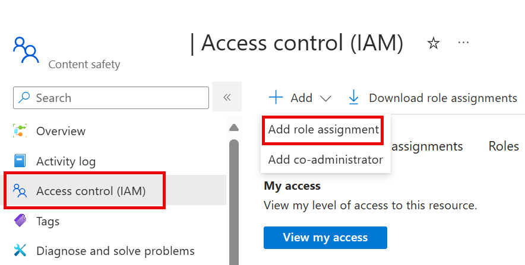

---
lab:
  title: Изучение безопасности содержимого в Azure AI Foundry
---

# Изучение безопасности содержимого в Azure AI Foundry

Службы ИИ Azure помогают пользователям создавать приложения ИИ с помощью готовых, предварительно созданных и настраиваемых API и моделей. В этом упражнении вы изучите одну из служб, безопасность содержимого ИИ Azure, которая позволяет модерировать текст и содержимое изображения. На портале Azure AI Foundry платформа Майкрософт для создания интеллектуальных приложений будет использовать безопасность содержимого ИИ Azure для классификации текста и назначения ей оценки серьезности. 

> **Примечание** Цель этого упражнения — получить общее представление о том, как подготавливаются и используются службы ИИ Azure. Безопасность содержимого используется в качестве примера, но в этом упражнении от вас не ожидается получения полных знаний о безопасности содержимого!

## Создание проекта на портале Azure AI Foundry

1. На вкладке браузера перейдите на [портал](https://ai.azure.com?azure-portal=true) Azure AI Foundry.

2. Войдите со своей учетной записью. 

3. На домашней странице портала Azure AI Foundry выберите **"Создать проект**". В Azure AI Foundry проекты — это контейнеры, которые помогают упорядочивать работу.  

    

4. *На панели "Создание проекта" вы увидите созданное имя проекта*, которое можно сохранить как есть. В зависимости от того, создали ли вы концентратор в прошлом, вы увидите список новых* ресурсов Azure или раскрывающийся список *существующих центров. Если вы видите раскрывающийся список существующих центров, выберите *"Создать концентратор*", создайте уникальное имя для концентратора и нажмите кнопку *"Далее*".  
 
    

> **Важно.** Чтобы завершить остальную часть лаборатории, вам потребуется повторно подготовленная службами ИИ Azure.

5. В той же *области проекта* выберите **"Настроить** " и выберите одно из следующих **расположений**: Восточная часть США, Центральная Франция, Центральная Корея, Западная Европа или Западная часть США, чтобы завершить остальную часть лаборатории. Затем нажмите кнопку **"Создать**". 

1. Запишите созданные ресурсы: 
- Службы ИИ Azure
- Центр искусственного интеллекта Azure
- Проект Azure AI
- Storage account
- Хранилище ключей
- Группа ресурсов  

6. После создания ресурсов вы получите на страницу обзора* проекта*. 

7. Чтобы использовать безопасность содержимого, необходимо обновить разрешения на *ресурс Центра* искусственного интеллекта Azure. Для этого откройте [портал Azure](https://portal.azure.com?portal-azure=true) и войдите в систему с той же подпиской, которую вы использовали для создания ресурсов Ai Foundry.  

8. В портал Azure используйте панель поиска в верхней части страницы, чтобы найти и выбрать **Azure AI Foundry**. На странице ресурсов выберите только что созданный ресурс, который является *типом* **Центра** искусственного интеллекта Azure.  

9. В портал Azure на левой панели выберите **контроль доступа (IAM).** Затем на открытой панели нажмите кнопку **"Добавить** рядом с знаком плюса" и выберите " **Добавить назначение роли**". 

10. **Найдите средство** оценки безопасности ИИ Azure в списке ролей и выберите его. Затем выберите **Далее**. 

11. Используйте следующие параметры, чтобы назначить себя роли: 
    - **Назначение доступа**: выбор *пользователя, группы или субъекта-службы*
    - **Элементы**: щелкните элемент *"Выбрать элементы"*
        - На открываемой *панели "Выбор элементов"* найдите свое имя. Щелкните значок плюса рядом с именем. Затем щелкните **Выбрать**.
    - **Описание**: *оставьте пустым*

12. Выберите "Рецензирование" и " **Назначить**", а затем нажмите кнопку **"Рецензирование" и "Назначить** ", чтобы добавить назначение роли.    

13. В браузере вернитесь на [портал](https://ai.azure.com?azure-portal=true) Azure AI Foundry. Выберите проект. 

14. В меню слева на экране выберите **службы** ИИ.
 
      

15. *На странице "Службы* искусственного интеллекта" выберите плитку *"Визуальное распознавание и документ*", чтобы попробовать возможности Azure AI Vision и Document.
    
    

## Попробуйте модерацию текста с помощью безопасности содержимого на портале Azure AI Foundry 

1. На странице "Безопасность* содержимого *" в разделе *"Фильтр текста" выберите **"Умеренный *текст**".

2. На странице "Умеренное *текстовое содержимое* " в разделе " *Попробовать"* выберите ресурс служб ИСКУССТВЕННОго интеллекта Azure, созданный в раскрывающемся меню.   

3. В разделе *"Запуск простого теста*" выберите плитку "Безопасное **содержимое** ". Обратите внимание, что текст отображается в поле ниже. 

4. Щелкните **Run test**(Выполнить проверку). Выполнение проверки вызывает модель глубокого обучения Службы безопасности содержимого. Модель глубокого обучения уже обучена распознавать небезопасное содержимое.

5. На панели *Результатов* проверьте результаты. Существует четыре уровня серьезности от безопасного до высокого уровня, а также четыре типа вредного содержимого. Считает ли служба ИИ Безопасности содержимого этот пример приемлемым или нет? Важно отметить, что результаты находятся в пределах доверительного интервала. Хорошо обученная модель, например одна из готовых моделей ИИ Azure, может возвращать результаты, которые с высокой вероятностью соответствуют тому, что человек отметил бы как результат. Каждый раз, когда вы запускаете проверку, вы снова вызываете модель. 

6. Теперь попробуйте другой пример. Выделите текст в разделе "Насильственное содержимое" с ошибками. Убедитесь, что содержимое отображается в приведенном ниже поле.

7. Нажмите кнопку **Выполнить проверку** и снова проверьте результаты на панели Результатов. 

Вы можете выполнить проверки на всех предоставленных примерах, а затем проверить результаты.

## Очистка

Если вы не собираетесь выполнять больше упражнений, удалите все ресурсы, которые больше не нужны. Это позволяет избежать каких-либо ненужных затрат.

1. [Откройте портал Azure]( https://portal.azure.com) и выберите группу ресурсов, содержащую созданный ресурс.
1. Выберите ресурс и нажмите кнопку **"Удалить** ", а затем **"Да** ", чтобы подтвердить. Затем ресурс удаляется.

## Подробнее

Это упражнение демонстрирует только некоторые возможности службы безопасности содержимого. Дополнительные сведения о том, что можно сделать с этой службой, см. на странице[ "Безопасность содержимого](https://learn.microsoft.com/azure/ai-services/content-safety/overview)".